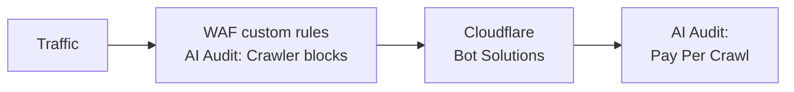

import { GlossaryTooltip, Example, Steps, Tabs, TabItem } from "~/components";

AI Audit works alongside other Cloudflare products, such as Cloudflare [Web Application Firewall (WAF)](/waf/). WAF checks incoming web and API requests, and filters undesired traffic based on rules. [WAF custom rules](/waf/custom-rules/) allow you to perform certain actions such as enforcing <GlossaryTooltip term="robots.txt">`robots.txt`</GlossaryTooltip>.

## Order of precedence

- AI Audit uses WAF custom rules to block the selection of AI crawlers the site owner has decided to block.
- AI Audit's pay per crawl feature takes place after WAF.

For this reason, if you plan on using AI Audit to manage AI crawlers, you may wish to modify your existing WAF custom rules such that it does not affect AI crawlers. This will allow you to manage AI crawlers only from AI Audit, thereby streamlining your workflow.

:::note[How AI Audit uses WAF custom rules]
When you block AI crawlers via AI Audit (either all or some), you are using **one** WAF custom rule to block those AI crawlers.

If you choose to allow all AI crawlers, AI Audit does not utilize any WAF custom rules.

Depending on the type of account you have, you may have a limited number of WAF custom rules.
:::

## Examples of using WAF vs AI Audit

Consider the following examples.

### Traffic from a restricted country vs pay per crawl

You may have both of the following features enabled:

- [WAF custom rule to block traffic from specific countries](/waf/custom-rules/use-cases/block-traffic-from-specific-countries/)
- AI Audit's [pay per crawl](/ai-audit/features/pay-per-crawl/what-is-pay-per-crawl/) to charge AI crawlers when they request access to your content

Since WAF custom rules are enforced before pay per crawl, traffic (including AI crawlers) from your blocked countries will continue to be blocked, even if they provide the [required headers](/ai-audit/features/pay-per-crawl/use-pay-per-crawl-as-ai-owner/crawl-pages/#1-include-required-headers) for pay per crawl.

### Allowed search engine bots via WAF custom rule vs pay per crawl

You may have both of the following features enabled:

- [WAF custom rule to allow search engine bots](/waf/custom-rules/use-cases/allow-traffic-from-verified-bots/)
- AI Audit's [pay per crawl](/ai-audit/features/pay-per-crawl/what-is-pay-per-crawl/) to charge all AI crawlers when they request access to your content (including search engine bots).

Since custom rules are enforced before pay per crawl:

- Only search engine bots will be able to access your site (enforced by custom rule).
- The search engine bots will then be charged for access to your content (enforced by AI Audit's pay per crawl).

:::note
This example only serves to highlight the order of precedence between WAF and AI Audit.

Practically, it may be beneficial to allow well-behaved search engine bots to access your content to ensure your content is indexed.
:::

### Conflict in AI crawler blocking logic

You may have both of the following features enabled:

- A WAF custom rule which blocks all bots.
- AI Audit selection which allows certain AI crawlers.

In this scenario, you have two custom rules, each directing a different logic for handling AI crawlers. To resolve this issue:

<Tabs syncKey="dashNewNav"> <TabItem label="Old dashboard">

<Steps>
1. Log in to the [Cloudflare dashboard](https://dash.cloudflare.com/), and select your account and domain.
2. Go to **Security** > **WAF** > **Custom rules** tab.
3. Identify your WAF custom rule and the AI Audit rule.
4. Drag the rule you wish to prioritize to the top, or modify your WAF custom rule to ensure it does not conflict with your AI Audit configurations.
</Steps>

</TabItem> <TabItem label="New dashboard" icon="rocket">

<Steps>
1. Log in to the [Cloudflare dashboard](https://dash.cloudflare.com/), and select your account and domain.
2. Go to **Security** > **Security rules** and filter by **Custom rules**.
3. Identify your custom rule and the AI Audit rule.
4. Drag the rule you wish to prioritize to the top, or modify your custom rule to ensure it does not conflict with your AI Audit configurations.
</Steps>

</TabItem> </Tabs>

