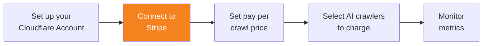

import { Steps } from "~/components";

Connect your Cloudflare account to Stripe to process payments. Pay per crawl uses Stripe to process payments between AI crawler owners and site owners.

{/* prettier-ignore */}
<Steps>
1. Log in to the [Cloudflare dashboard](https://dash.cloudflare.com/), and select your account and domain.
2. Go to **AI Audit**.
3. Go to the **Settings** tab.
4. Under **Pay Per Crawl**, select **Connect**.
5. Select **Continue to Stripe**.
6. Follow the on-screen instructions to connect your Cloudflare account to a Stripe account.
</Steps>

When you successfully connect Stripe to your account, you will see a green tick ✅ next to **Stripe connection**.

## Billing

Cloudflare manages the billing lifecycle from charge initiation to payout.

The billing workflow begins when an AI crawler indicates payment intent via request header. A charge event is recorded upon successful delivery of the requested content. Cloudflare subsequently aggregates and reconciles all recorded charges.

Payouts are remitted to publishers in good standing on a monthly cycle and subject to a settlement period and payout threshold.