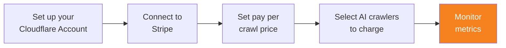

import { Steps } from "~/components";

Once you have confirmed the selection of AI crawlers to charge, monitor key metrics to understand how AI crawlers are interacting with your content.

{/* prettier-ignore */}
<Steps>
1. Go to the **Metrics** tab.
2. [View AI Audit metrics](/ai-audit/features/analyze-ai-traffic/#view-ai-audit-metrics). Understanding these metrics can help you better manage AI crawlers accessing your content.
</Steps>

## Other considerations

You may also wish to do the following:

1. Update your `robots.txt` to clearly indicate which pages are off-limits, even if AI crawlers are willing to pay for the content.

## Additional resources

You may wish to refer to the following resources.

- [AI Audit FAQs](/ai-audit/reference/faq/).