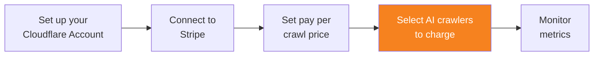

import { Steps } from "~/components";

Once you have set a pay per crawl price, AI Audit automatically sets the default action for all applicable AI crawlers as **Charge**. However, you can control which action to take for each AI crawler.

{/* prettier-ignore */}
<Steps>
1. Go to the **AI Crawlers** tab.
2. Use the selection slider in the **Actions** column to configure the setting for each AI crawler.
</Steps>

AI crawlers for which you select **Charge** will be prompted to pay your configured pay per crawl price each time they attempt to scrape content from a zone.

Refer to [Manage AI crawlers](/ai-audit/features/manage-ai-crawlers/) for more information on how to manage AI crawlers.
