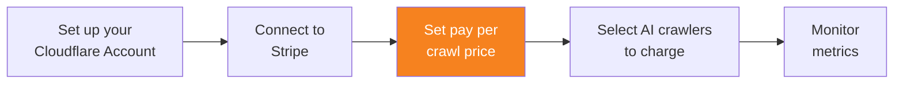

import { Steps } from "~/components";

Once you have connected your Stripe account, you can set your pay per crawl price.

{/* prettier-ignore */}
<Steps>
1. From the [Cloudflare dashboard](https://dash.cloudflare.com/), select your account and domain.
2. Go to **AI Audit**.
3. Go to the **Settings** tab.
4. From **Pay Per Crawl**, select the **Edit** icon under **Pay Per Crawl price**.
5. Enter the pay per crawl price you wish to set. Note that smallest unit of payment is 0.01 USD.
6. Select **Save**.
</Steps>

:::note
When you configure a pay per crawl price, AI Audit automatically sets the default action for all applicable AI crawlers as **Charge**.
:::